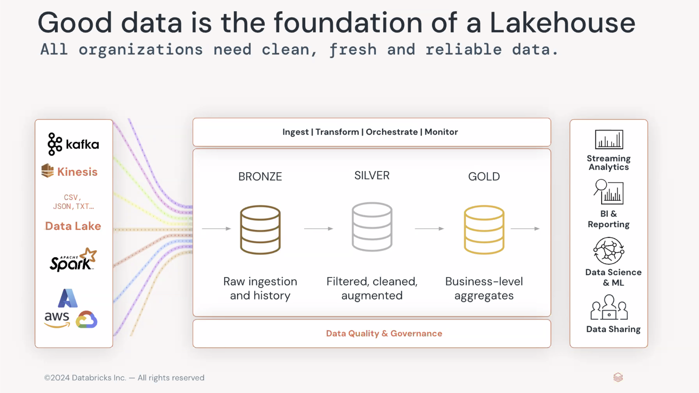

# Data Storage

## Core Storage Concepts

- **Schema-on-Read:** data lakes apply structure only when the data is queried or processed, offering flexibility for diverse data types.
- **Schema-on-Write:** data warehouses enforce a predefined schema when data is written, ensuring consistency and optimized performance for structured data.
- **Raw, Native Format:** Data is stored in its original, unprocessed form, accommodating structured, semi-structured, and unstructured data like images, videos, and logs.
- **Object Storage & Distributed File Systems:** Data lakes utilize scalable storage solutions like Amazon S3, Google Cloud Storage, or Hadoop HDFS to manage large volumes of data efficiently.

## Key Structural Methods

### Zoning

- **Raw Zone:** Stores data in its untouched, binary copy of the source format. This is a persistent, immutable copy for data lineage and reprocessing.
- **Staging/Processing Zone:** Data is cleaned, transformed, and enriched for analysis.
- **Semantic/Insights Zone:** Curated data, optimized for specific use cases like business intelligence or machine learning.

A [Medallion Architecture](https://www.databricks.com/glossary/medallion-architecture) is a data design pattern used to logically organize data in a lakehouse, with the goal of incrementally and progressively improving the structure and quality of data as it flows through each layer of the architecture. (AKA "multi-hop" architectures).

### Partitioning

- **Purpose:** Divides data into smaller, logical units (like folders for year, month, day) to speed up queries by allowing the system to scan only relevant partitions.
- **Best Practices:** Partition by date or high-cardinality fields that are frequently used in queries. Aim for partitions that are not too large (to avoid large file issues) or too small (to avoid metadata overhead).

### File Formats

- **Columnar Formats:** Using formats like Parquet, ORC, or Avro improves compression and allows query engines to read only the necessary columns, significantly speeding up analytical queries.

### Folder Structures

- **Natural Hierarchy:** Implement nested folder structures for intuitive navigation and to support partitioning.
  - e.g., /year=2022/month=January/day=1/
  - e.g., /2022/01/01/

## Benefits of Structural Methods

- **Avoids Data Swamps:** A well-defined structure prevents the data lake from becoming a disorganized "data swamp," where data is hard to find, understand, and use.
- **Scalability:** These methods are essential for managing the massive scale of data typically stored in a data lake.
- **Performance Optimization:** Efficient file formats, partitioning, and zoning improve query performance and reduce processing costs.
