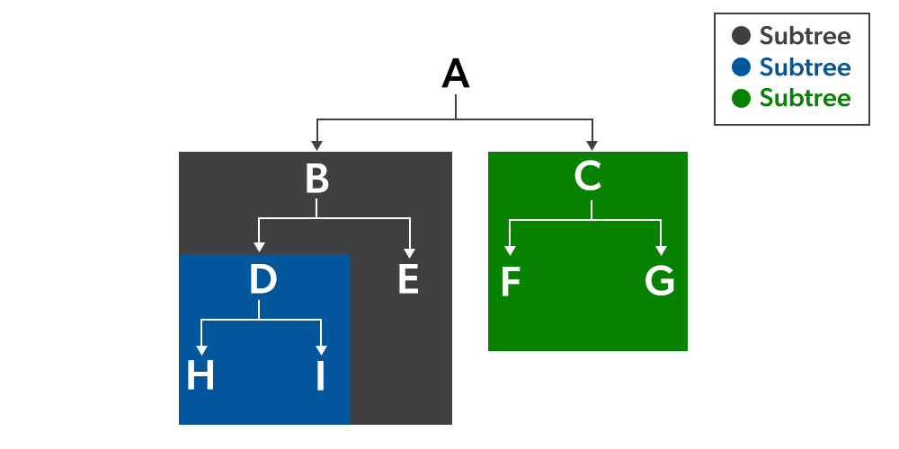

# `git` & `GitHub`

[@GetCommunity](https://github.com/GetCommunity) on GitHub

## Core Contributors

- [@JoeyGrable94](https://github.com/JoeyGrable94)

## Table of Contents

- [`git` \& `GitHub`](#git--github)
  - [Core Contributors](#core-contributors)
  - [Table of Contents](#table-of-contents)
  - [Basic Configuration](#basic-configuration)
    - [Useful Aliases](#useful-aliases)
      - [Unset an alias](#unset-an-alias)
  - [Submodules](#submodules)
  - [Subtrees](#subtrees)

## Basic Configuration

### Useful Aliases

```bash
git config --global alias.co checkout
git config --global alias.br branch
git config --global alias.cm commit
git config --global alias.st status
git config --global alias.last 'log -1 HEAD'
```

#### Unset an alias

```bash
git config --global --unset alias.<alias-name>
```

## Submodules

## Subtrees

[Git Subtree](https://www.geeksforgeeks.org/git-subtree/) by Geeks for Geeks
[Git Subtree basics](https://gist.github.com/SKempin/b7857a6ff6bddb05717cc17a44091202) by Stephen Kempin
[Mastering Git Subtrees](https://medium.com/@porteneuve/mastering-git-subtrees-943d29a798ec) by Christophe Porteneuve
[Git Subtrees vs Submodules](https://training.github.com/downloads/submodule-vs-subtree-cheat-sheet/) by GitHub


