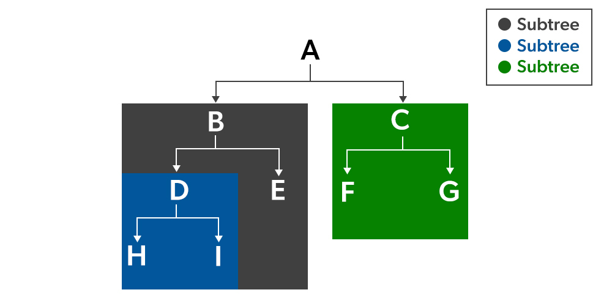

# `git` & `GitHub`

[@GetCommunity](https://github.com/GetCommunity) on GitHub

## Core Contributors

- [@JoeyGrable94](https://github.com/JoeyGrable94)

## Table of Contents

- [`git` \& `GitHub`](#git--github)
  - [Core Contributors](#core-contributors)
  - [Table of Contents](#table-of-contents)
  - [Basic Configuration](#basic-configuration)
    - [Useful Aliases](#useful-aliases)
      - [Unset an alias](#unset-an-alias)
  - [Submodules](#submodules)
  - [Subtrees](#subtrees)
  - [Pre-commit Hooks](#pre-commit-hooks)
  - [Rebase Upsteam Branch Into Current Main Branch](#rebase-upsteam-branch-into-current-main-branch)

## Basic Configuration

### Useful Aliases

```bash
git config --global alias.co checkout
git config --global alias.br branch
git config --global alias.cm commit
git config --global alias.st status
git config --global alias.sw switch
git config --global alias.last 'log -1 HEAD'
alias.log-graph log --oneline --graph --all --decorate
git config --global alias.merge-main-with-prod '!git switch main && git merge production && git push origin main && git switch production'

# to list all git aliases
git config --get-regexp ^alias\.

```

#### Unset an alias

```bash
git config --global --unset alias.<alias-name>
```

## Submodules

```bash
git submodule add <repository> <path>
```

## Subtrees

[Git Subtree](https://www.geeksforgeeks.org/git-subtree/) by Geeks for Geeks
[Git Subtree basics](https://gist.github.com/SKempin/b7857a6ff6bddb05717cc17a44091202) by Stephen Kempin
[Mastering Git Subtrees](https://medium.com/@porteneuve/mastering-git-subtrees-943d29a798ec) by Christophe Porteneuve
[Git Subtrees vs Submodules](https://training.github.com/downloads/submodule-vs-subtree-cheat-sheet/) by GitHub



## Pre-commit Hooks

```bash
pre-commit install
```

## Rebase Upsteam Branch Into Current Main Branch

```bash
# 0) (once) ensure the upstream remote exists
git remote add upstream <URL-to-upstream>  # skip if already added

# 1) fetch the latest from upstream, make sure both remotes are up to date
git fetch origin
git fetch upstream

# 2) back up your current main just in case
git checkout main
git branch backup/main-$(date +%Y%m%d-%H%M%S)

# 3) hard reset your local main to upstream/main
git reset --hard upstream/main
```

To keep origin/main’s history and adopt upstream/main’s content without rebasing or force-pushing by doing a special merge that preserves your current tree but records origin’s history: 

```bash
# create a merge commit that **keeps your current files** (the upstream snapshot)
# but **includes origin/main as a parent** so history is preserved
git merge -s ours origin/main -m "Adopt upstream/main changes; preserve origin/main history"

# now push normally — this is a fast-forward for origin because its tip is an ancestor of this merge
git push origin main
```

To completely reset your local main to match upstream/main and force-push that to origin/main:

```bash
# (optional) clean any untracked files/dirs that differ
git clean -fd

# push to your origin, rewriting its main to match upstream
git push origin main --force-with-lease
```
