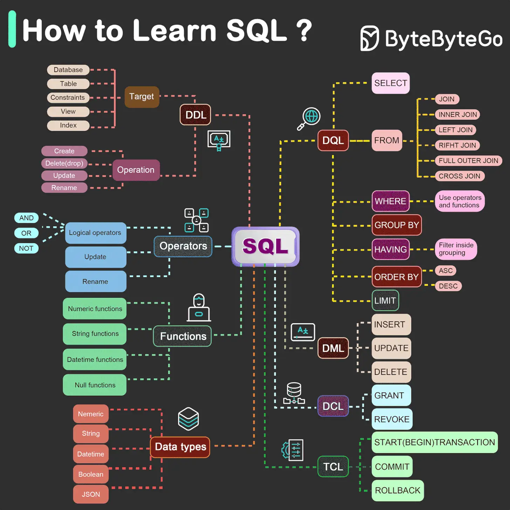

# Structured Query Language (SQL)

SQL is a language for defining the structure of data, and querying and manipulating data records.

Standardized in 1986, there are five core components of the SQL:

- DDL: Data Definition Language — `CREATE`, `ALTER`, `DROP`
- DQL: Data Query Language — `SELECT`
- DML: Data Manipulation Language — `INSERT`, `UPDATE`, `DELETE`
- DCL: Data Control Language — `GRANT`, `REVOKE`
- TCL: Transaction Control Language — `COMMIT`, `ROLLBACK`

