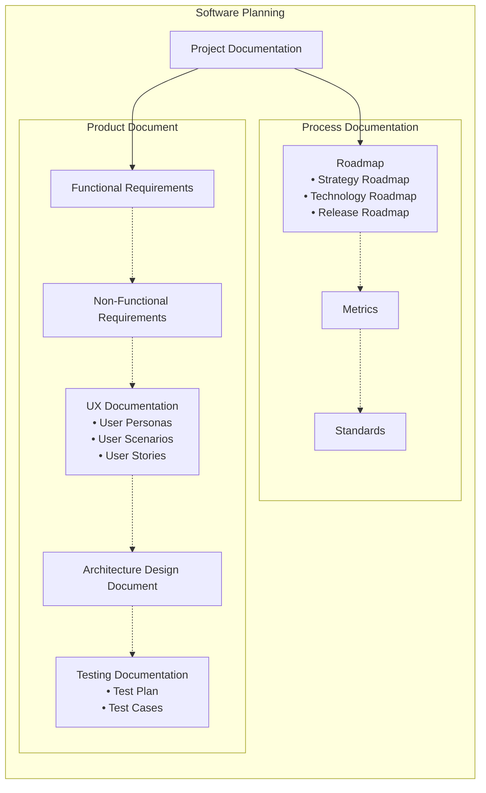
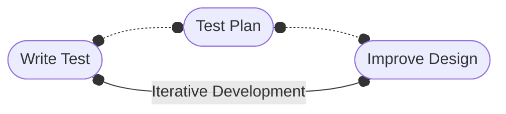
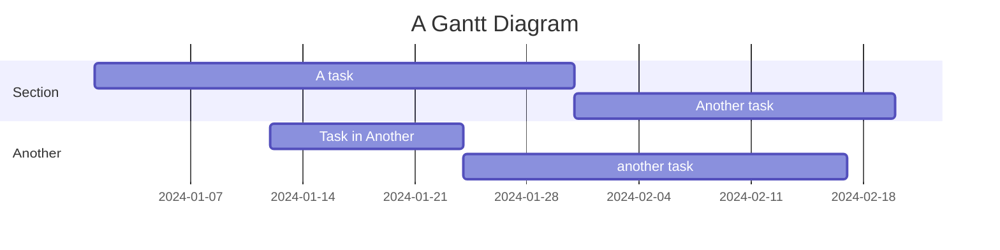

# Software Planning and Technical Documentation

- [Software Planning and Technical Documentation](#software-planning-and-technical-documentation)
  - [Project Documentation](#project-documentation)
    - [Product Documentation](#product-documentation)
      - [Functional Requirements (User Features)](#functional-requirements-user-features)
      - [Non-Functional Requirements (System Properties)](#non-functional-requirements-system-properties)
      - [Product Requirement Document (UX Documentation)](#product-requirement-document-ux-documentation)
        - [User Personas](#user-personas)
        - [User Scenarios](#user-scenarios)
        - [User Stories](#user-stories)
        - [Deliverables](#deliverables)
          - [Wireframes](#wireframes)
          - [Prototypes](#prototypes)
          - [Journey Maps](#journey-maps)
      - [Architecture Design Document](#architecture-design-document)
        - [Presentation Layer](#presentation-layer)
        - [Business Logic Layer](#business-logic-layer)
        - [Database Layer](#database-layer)
      - [Testing Documentation](#testing-documentation)
        - [Test Plan](#test-plan)
        - [Test Cases](#test-cases)
    - [Process Documentation](#process-documentation)
      - [Roadmap](#roadmap)
        - [Strategy Roadmap](#strategy-roadmap)
        - [Technology Roadmap](#technology-roadmap)
        - [Release Roadmap](#release-roadmap)
      - [Metrics](#metrics)
        - [Work in Progress (WIP)](#work-in-progress-wip)
        - [Process Health \& Bottlenecks](#process-health--bottlenecks)
        - [Code Quality](#code-quality)
      - [Standards](#standards)
  - [Additional Resource \& Tools](#additional-resource--tools)
    - [Mistakes Can be Prevented by Over Preparing](#mistakes-can-be-prevented-by-over-preparing)
    - [The Gantt Chart](#the-gantt-chart)

## Project Documentation

### Product Documentation

*What should the product be like?*

A **Product** is a system with set of features that helps users achieve their goals.

#### Functional Requirements (User Features)

These are the **features** that the system should have in order to meet the user needs.

Example Functional Requirements:

- A user should be able to sign up for the newsletter on the home page.
  - talks to the user's capability

#### Non-Functional Requirements (System Properties)

These are the **properties** of the system that are required in order to make the system usable, reliable, and secure.

Example Non-Functional Requirements:

- The system should be able to handle 1000 users at the same time.
  - --> talks to the system's capability

#### Product Requirement Document (UX Documentation)

A Product Requirement Document is a document that translates the user and stakeholder desires into requirements that developers and designers can understand and implement.

Requirements are largely dictacted by user research. User research should be conducted early in the project to understand the user needs, preferences and experiences. This research should yield a set of user personas, user scenarios, and user stories that can be used to guide the design and development of the product.

##### User Personas

A persona detailed description of a typical user that allows the dev-team to visualize what the users want, need, and how they behave. The user personas should include:

- Demographics
- Biography
- Personality Traits
- Motivations

The behavior of a persona is broken down into user scenarios.

##### User Scenarios

A user scenario describe a user acomplishing a task and help designers understand a users thought process and motivations. User scenarios are often written in a comic strip format to visualize the journey of the user.

These scenarios are then broken down into user stories.

##### User Stories

A user story is written from the perspective of the user and look like specific end features.

Example User Stories:

- As a manager, I want to be able to create UTM tracking links so that I can track the performance of my marketing campaigns, and manage the links in one place for each client.
- As an administrator I want to manage which users can access certain clients data.

##### Deliverables

All the user research documents are used to compile deliverables. These deliverables are suplumental documentation with product prototypes, wireframes, and user journey maps that describe the final user experience.

###### Wireframes

A wireframe is a simple, skeletal layout that focuses on the structure and flow of a page or layout.

###### Prototypes

A prototype is a detailed, interactive representation of the final product that allows the designer to interact with the product before it is built.

###### Journey Maps

A jounry map is a visual representation of the user's actions, thoughts, and emotions at each stage of the user experience. Jouney maps include a user, a scenario, and the expectations or goals at the top, high-level phases of the journey in the middle, and takeaways at the bottom. The jounry should progress through key phases of the user experience, such as:

1. awareness
2. consideration
3. evaluation
4. purchase
5. onboarding
6. retention
7. advocacy

#### Architecture Design Document

The Architecture Design Document is a document that describes the software architecture of the system. The document should desribe and visualize the design choices and the rationale behind them. A software architect is responsible for creating architecture depictions. These depictions are schematic diagrams that communicate to the team what components and design principles should be used without many techn details.

1. Presentation
2. Business Logic
3. Database

##### Presentation Layer

##### Business Logic Layer

##### Database Layer

#### Testing Documentation

Test Driven Development (TDD) approach.

##### Test Plan

The test plan is made up of specific **test cases** to be conducted and should give timeframes and assign roles to QA developers.

##### Test Cases

Test cases are detailed descriptions of what features should be tested and how step by step. Test cases should be based on system requirements derived from the product document.

### Process Documentation

*How are we going to build it?*

The process document explains how the product should be built and all the processes around the product. The primary tool in the process document is the product roadmap. The product roadmap is broken down into three main sections: strategy roadmap, technology roadmap, and release roadmap.

[Gantt Charts](#the-gantt-chart) are used to visualize the project timeline for each roadmap.

#### Roadmap

##### Strategy Roadmap

The strategy roadmap should contain high-level goals and rough delivery estimates. This roadmap should not be details and should be able to represent the whole project on a single screen.

##### Technology Roadmap

The technology roadmap should be low-level and contain the smallest deliverables and their due dates. This roadmap should be detailed and discuss specific technologies and tools that will be used in the project.

##### Release Roadmap

The release roadmap contains strict deadlines for when each part of the project should start functioning and what features go live, when.

#### Metrics

Project metrics provide regular feedback on how fast and effective the work is. Metrics should catch bottlenecks and problems in the code quality before proliferating.

##### Work in Progress (WIP)

**Velocity**: the amount of work that the team can complete in a given time period.

**Sprint Burndown**: a chart that shows the amount of work that the team has completed in a sprint.

**Release Burndown**: a chart that shows the amount of work that the team has completed in a release.

##### Process Health & Bottlenecks

**Cycle Time**: the time it takes for a task to move from the start of the process to the end.

**Cumulative Flow**: a chart that show  the progress of activities done in the sprint.

**Flow Efficiency**: the percentage of time that a task is actively being worked on.

##### Code Quality

**Code Coverage**: the percentage of code that is covered by tests.

**Automation vs. Manual Tests**: identify all tasks that can be automated and those that need to be done manually.

**Code Churn**: the amount of code that is added, removed, or changed in a given time period.

McCabe Cyclomatic Complexity (MCC): a common metric used to measure the complexity of code and to assess the risk of problems that may occur during code maintenance and testing.

#### Standards

The team should establish best practices that every team member can use to create consistent code and design. Standards may be established for code, tests, design, documentation, and more.

----

## Additional Resource & Tools

### Mistakes Can be Prevented by Over Preparing

- Don't start working on feature before you start working on features.
- Written documentation is betten that spoken history.

### The Gantt Chart

The Gantt Chart is a visual representation of the project timeline.

